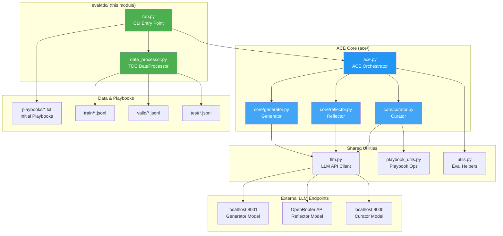
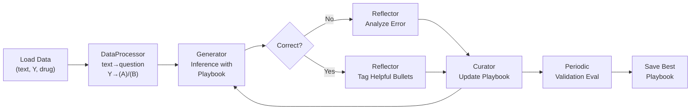

# ACE for TDC — Binary Classification Tasks

> [中文版](./README_zh.md)

This module runs the [ACE (Agent-Curator-Environment)](../../README.md) system on [TDC (Therapeutics Data Commons)](https://tdcommons.ai/) binary classification tasks, using pre-computed molecular properties as context.

---

## Architecture



**Data flow in offline training:**



---

## Supported Tasks (16)

| Task | Description |
|------|-------------|
| AMES | Mutagenicity prediction |
| BBB_Martins | Blood-brain barrier penetration |
| Bioavailability_Ma | Oral bioavailability |
| CYP2C9_Substrate_CarbonMangels | CYP2C9 substrate prediction |
| CYP2D6_Substrate_CarbonMangels | CYP2D6 substrate prediction |
| CYP3A4_Substrate_CarbonMangels | CYP3A4 substrate prediction |
| Carcinogens_Lagunin | Carcinogenicity prediction |
| ClinTox | Clinical toxicity |
| DILI | Drug-induced liver injury |
| HIA_Hou | Human intestinal absorption |
| PAMPA_NCATS | Membrane permeability |
| Pgp_Broccatelli | P-glycoprotein inhibition |
| SARSCoV2_3CLPro_Diamond | SARS-CoV-2 3CLPro inhibition |
| SARSCoV2_Vitro_Touret | SARS-CoV-2 in-vitro activity |
| Skin_Reaction | Skin sensitization |
| hERG | hERG channel blocking |

All tasks are binary classification: the model outputs **(A)** or **(B)**.

---

## Data Format

Each JSONL sample has:

| Field | Description | Example |
|-------|-------------|---------|
| `text` | Full prompt with pre-computed molecular properties + question | `"=== Precomputed Tool Results... Question: ... (A) ... (B) ..."` |
| `Y` | Ground truth label | `0` → (A), `1` → (B) |
| `drug` | SMILES string | `"Nc1cccc([N+](=O)[O-])c1CO"` |

The `text` field already contains everything the model needs — no tool calls or additional computation required.

---

## Prerequisites

1. **Local vLLM servers** running:
   - Port **8001**: Generator model
   - Port **8000**: Curator model
2. **OpenRouter API key** in `.env` file (`OPENROUTER_API_KEY_Mark_3`)
3. **Initial playbooks** in `playbooks/` directory (one per task, e.g. `playbooks/AMES.txt`)

---

## How to Run

### Single Task

```bash
cd /data1/tianang/Projects/ace

.venv/bin/python -m eval.tdc.run \
  --task_name AMES \
  --mode offline \
  --generator_model <YOUR_LOCAL_MODEL_ON_8001> \
  --reflector_model <YOUR_OPENROUTER_MODEL> \
  --curator_model <YOUR_LOCAL_MODEL_ON_8000> \
  --save_path ./results/tdc \
  --num_epochs 1 \
  --eval_steps 50 \
  --curator_on_correction_only \
  --skip_initial_test \
  --skip_final_test \
  --run_initial_val \
  --run_final_val
```

### All 16 Tasks (Sequential)

```bash
.venv/bin/python -m eval.tdc.run \
  --run_all \
  --generator_model <model> \
  --reflector_model <model> \
  --curator_model <model> \
  --save_path ./results/tdc \
  --curator_on_correction_only \
  --skip_initial_test \
  --skip_final_test \
  --run_initial_val \
  --run_final_val
```

### Quick Debug Run (Limited Samples)

```bash
.venv/bin/python -m eval.tdc.run \
  --task_name AMES \
  --mode offline \
  --generator_model <model> \
  --reflector_model <model> \
  --curator_model <model> \
  --save_path ./results/tdc_debug \
  --max_train_samples 10 \
  --max_val_samples 5 \
  --eval_steps 5 \
  --save_steps 5 \
  --curator_on_correction_only \
  --skip_initial_test \
  --skip_final_test \
  --run_initial_val \
  --run_final_val
```

### Evaluation Only (No Training)

```bash
.venv/bin/python -m eval.tdc.run \
  --task_name AMES \
  --mode eval_only \
  --generator_model <model> \
  --reflector_model <model> \
  --curator_model <model> \
  --initial_playbook_path ./results/tdc/best_playbook.txt \
  --save_path ./results/tdc_eval
```

---

## CLI Arguments Reference

| Argument | Default | Description |
|----------|---------|-------------|
| `--task_name` | — | TDC task name (e.g., `AMES`) |
| `--run_all` | `false` | Run all 16 tasks |
| `--data_dir` | `<prepended data path>` | Base data directory |
| `--mode` | `offline` | `offline` / `online` / `eval_only` |
| `--generator_model` | *required* | Model name on port 8001 |
| `--reflector_model` | *required* | OpenRouter model name |
| `--curator_model` | *required* | Model name on port 8000 |
| `--generator_base_url` | `http://localhost:8001/v1` | Generator endpoint |
| `--reflector_base_url` | `https://openrouter.ai/api/v1` | Reflector endpoint |
| `--curator_base_url` | `http://localhost:8000/v1` | Curator endpoint |
| `--num_epochs` | `1` | Training epochs |
| `--eval_steps` | `100` | Validate every N steps |
| `--curator_frequency` | `1` | Curate every N steps |
| `--curator_on_correction_only` | `false` | Only curate when reflection corrects a wrong answer |
| `--max_tokens` | `4096` | Max response tokens |
| `--test_workers` | `20` | Parallel eval workers |
| `--max_train_samples` | all | Limit train samples |
| `--max_val_samples` | all | Limit val samples |
| `--save_path` | *required* | Results output directory |
| `--initial_playbook_path` | `playbooks/{task}.txt` | Custom playbook path |
| `--json_mode` | `false` | Force JSON output |
| `--skip_initial_test` | `false` | Skip initial test evaluation before training |
| `--skip_final_test` | `false` | Skip final test evaluation after training |
| `--run_initial_val` | `false` | Run validation evaluation before training |
| `--run_final_val` | `false` | Run validation evaluation after training |

---

## Output Structure

```
results/tdc/
└── ace_run_YYYYMMDD_HHMMSS_AMES_offline/
    ├── run_config.json                 # Full run configuration
    ├── train_results.json              # Training accuracy over time
    ├── val_results.json                # Validation results per eval step
    ├── pre_train_post_train_results.json
    ├── final_playbook.txt              # Playbook at end of training
    ├── best_playbook.txt               # Best playbook by val accuracy
    ├── final_results.json              # Consolidated results
    ├── bullet_usage_log.jsonl          # Bullet usage tracking
    ├── intermediate_playbooks/         # Snapshots during training
    └── detailed_llm_logs/              # Per-call LLM logs
```
