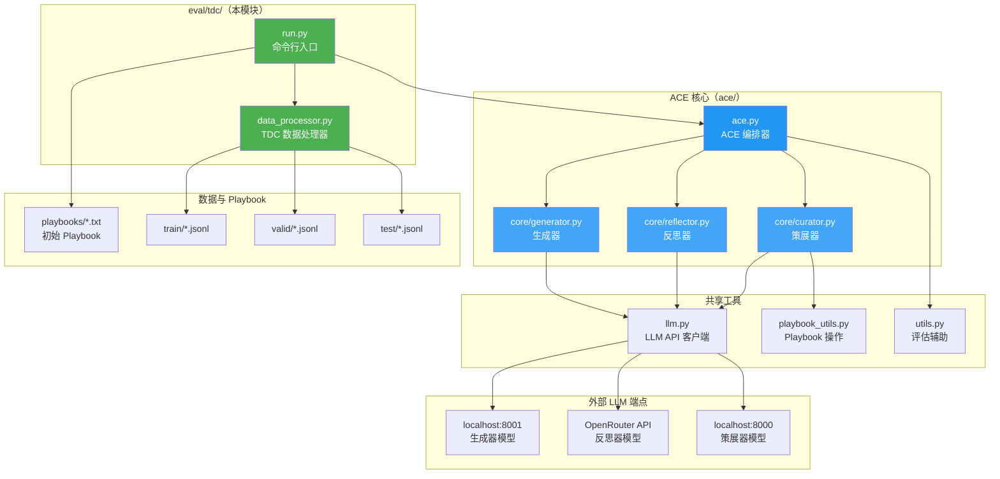
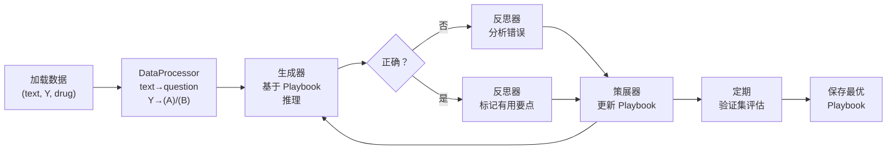

# ACE 用于 TDC — 二分类任务

> [English Version](./README.md)

本模块在 [TDC (Therapeutics Data Commons)](https://tdcommons.ai/) 二分类任务上运行 [ACE (Agent-Curator-Environment)](../../README.md) 系统，使用预计算的分子理化性质作为上下文。

---

## 架构图



**离线训练数据流：**



---

## 支持的任务（16 个）

| 任务 | 描述 |
|------|------|
| AMES | 致突变性预测 |
| BBB_Martins | 血脑屏障穿透 |
| Bioavailability_Ma | 口服生物利用度 |
| CYP2C9_Substrate_CarbonMangels | CYP2C9 底物预测 |
| CYP2D6_Substrate_CarbonMangels | CYP2D6 底物预测 |
| CYP3A4_Substrate_CarbonMangels | CYP3A4 底物预测 |
| Carcinogens_Lagunin | 致癌性预测 |
| ClinTox | 临床毒性 |
| DILI | 药物性肝损伤 |
| HIA_Hou | 人肠吸收 |
| PAMPA_NCATS | 膜渗透性 |
| Pgp_Broccatelli | P-糖蛋白抑制 |
| SARSCoV2_3CLPro_Diamond | SARS-CoV-2 3CLPro 抑制 |
| SARSCoV2_Vitro_Touret | SARS-CoV-2 体外活性 |
| Skin_Reaction | 皮肤敏感性 |
| hERG | hERG 通道阻断 |

所有任务均为二分类：模型输出 **(A)** 或 **(B)**。

---

## 数据格式

每条 JSONL 样本包含：

| 字段 | 描述 | 示例 |
|------|------|------|
| `text` | 完整提示词（预计算分子性质 + 问题） | `"=== Precomputed Tool Results... Question: ... (A) ... (B) ..."` |
| `Y` | 真实标签 | `0` → (A)，`1` → (B) |
| `drug` | SMILES 字符串 | `"Nc1cccc([N+](=O)[O-])c1CO"` |

`text` 字段已包含模型所需的全部信息——无需工具调用或额外计算。

---

## 前置条件

1. **本地 vLLM 服务**已启动：
   - 端口 **8001**：生成器模型
   - 端口 **8000**：策展器模型
2. `.env` 文件中配置了 **OpenRouter API Key**（`OPENROUTER_API_KEY_Mark_3`）
3. `playbooks/` 目录下有**初始 Playbook**（每个任务一个，如 `playbooks/AMES.txt`）

---

## 如何运行

### 运行单个任务

```bash
cd /data1/tianang/Projects/ace

.venv/bin/python -m eval.tdc.run \
  --task_name AMES \
  --mode offline \
  --generator_model <8001端口的模型名> \
  --reflector_model <OpenRouter模型名> \
  --curator_model <8000端口的模型名> \
  --save_path ./results/tdc \
  --num_epochs 1 \
  --eval_steps 50 \
  --curator_on_correction_only \
  --skip_initial_test \
  --skip_final_test \
  --run_initial_val \
  --run_final_val
```

### 运行全部 16 个任务（顺序执行）

```bash
.venv/bin/python -m eval.tdc.run \
  --run_all \
  --generator_model <模型名> \
  --reflector_model <模型名> \
  --curator_model <模型名> \
  --save_path ./results/tdc \
  --curator_on_correction_only \
  --skip_initial_test \
  --skip_final_test \
  --run_initial_val \
  --run_final_val
```

### 快速调试（限制样本数）

```bash
.venv/bin/python -m eval.tdc.run \
  --task_name AMES \
  --mode offline \
  --generator_model <模型名> \
  --reflector_model <模型名> \
  --curator_model <模型名> \
  --save_path ./results/tdc_debug \
  --max_train_samples 10 \
  --max_val_samples 5 \
  --eval_steps 5 \
  --save_steps 5 \
  --curator_on_correction_only \
  --skip_initial_test \
  --skip_final_test \
  --run_initial_val \
  --run_final_val
```

### 仅评估（不训练）

```bash
.venv/bin/python -m eval.tdc.run \
  --task_name AMES \
  --mode eval_only \
  --generator_model <模型名> \
  --reflector_model <模型名> \
  --curator_model <模型名> \
  --initial_playbook_path ./results/tdc/best_playbook.txt \
  --save_path ./results/tdc_eval
```

---

## 命令行参数速查

| 参数 | 默认值 | 说明 |
|------|--------|------|
| `--task_name` | — | TDC 任务名（如 `AMES`） |
| `--run_all` | `false` | 运行全部 16 个任务 |
| `--data_dir` | `<预处理数据路径>` | 数据根目录 |
| `--mode` | `offline` | `offline` / `online` / `eval_only` |
| `--generator_model` | *必填* | 8001 端口上的模型名 |
| `--reflector_model` | *必填* | OpenRouter 模型名 |
| `--curator_model` | *必填* | 8000 端口上的模型名 |
| `--generator_base_url` | `http://localhost:8001/v1` | 生成器端点 |
| `--reflector_base_url` | `https://openrouter.ai/api/v1` | 反思器端点 |
| `--curator_base_url` | `http://localhost:8000/v1` | 策展器端点 |
| `--num_epochs` | `1` | 训练轮数 |
| `--eval_steps` | `100` | 每 N 步验证一次 |
| `--curator_frequency` | `1` | 每 N 步更新 Playbook |
| `--curator_on_correction_only` | `false` | 仅在反思纠正了错误答案时才更新 Playbook |
| `--max_tokens` | `4096` | 最大响应 token 数 |
| `--test_workers` | `20` | 并行评估线程数 |
| `--max_train_samples` | 全部 | 限制训练样本数 |
| `--max_val_samples` | 全部 | 限制验证样本数 |
| `--save_path` | *必填* | 结果输出目录 |
| `--initial_playbook_path` | `playbooks/{任务名}.txt` | 自定义 Playbook 路径 |
| `--json_mode` | `false` | 强制 JSON 输出 |
| `--skip_initial_test` | `false` | 跳过训练前的初始测试评估 |
| `--skip_final_test` | `false` | 跳过训练后的最终测试评估 |
| `--run_initial_val` | `false` | 训练前在验证集上评估 |
| `--run_final_val` | `false` | 训练后在验证集上评估 |

---

## 输出目录结构

```
results/tdc/
└── ace_run_YYYYMMDD_HHMMSS_AMES_offline/
    ├── run_config.json                 # 完整运行配置
    ├── train_results.json              # 训练准确率变化
    ├── val_results.json                # 每次验证的结果
    ├── pre_train_post_train_results.json
    ├── final_playbook.txt              # 训练结束时的 Playbook
    ├── best_playbook.txt               # 验证集最优 Playbook
    ├── final_results.json              # 汇总结果
    ├── bullet_usage_log.jsonl          # 要点使用追踪
    ├── intermediate_playbooks/         # 训练过程中的快照
    └── detailed_llm_logs/              # 每次 LLM 调用的详细日志
```
